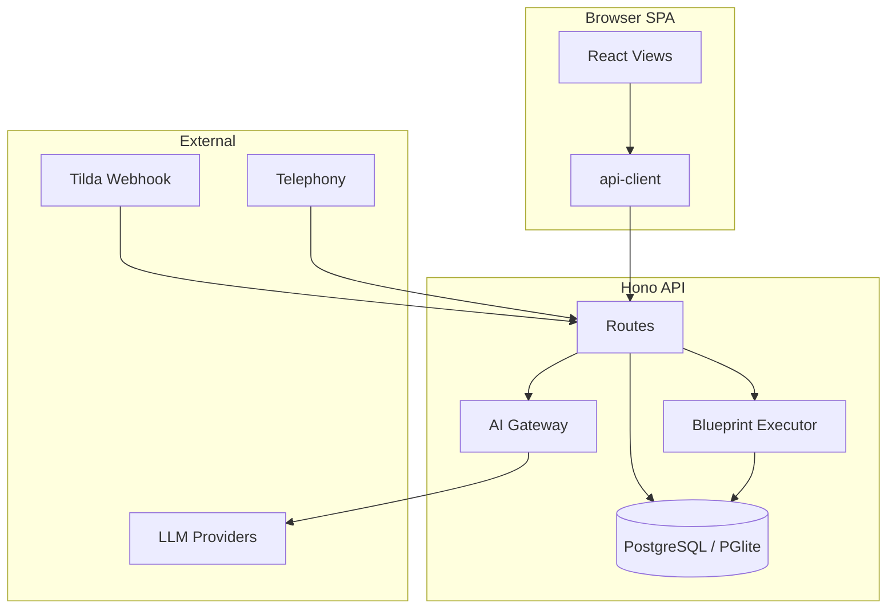

# Архитектура CRM — полная версия

**Дата:** 2026-06-22  
**Версия:** 3.2.0 — актуальный снимок в [v3.2.0/](./v3.2.0/)  
**Индекс всех файлов:** [FILE_INDEX.md](./FILE_INDEX.md) | снимок: [v3.2.0/FILE_INDEX.md](./v3.2.0/FILE_INDEX.md)

---

## 1. Назначение системы

CRM — универсальная CRM-платформа с модульной AI-интеграцией:

| Модуль | Назначение |
|--------|------------|
| **CRM Core** | Лиды, воронки, задачи, команда, RBAC |
| **Реактор v3.2** | Продукты CRM: flow/view/data + режим Маска (живой UX, ручной дизайн, AI Compose) |
| **Реактор (Blueprint legacy)** | Визуальные сценарии автоматизации на графе |
| **AIboard** | BI-агрегация, AI-аналитик, метрики |
| **Site Reactor** | Конструктор лендингов / UI Manifest |
| **ЭДО** | Документы, подпись CryptoPro, webhooks |
| **Agent API** | JIT-доступ для AI-агентов к сущностям CRM |
| **Telephony** | Звонки, записи, Whisper-транскрипция |

---

## 2. Топология репозитория (monorepo)

```
sdr_crm/
├── src/                    # React SPA (Vite)
├── server/                 # Hono API + Drizzle ORM
├── packages/
│   ├── api-client/         # Типизированный HTTP-клиент
│   ├── aiboard-core/       # Агрегация, метрики, источники
│   ├── blueprint-core/     # Движок графа Blueprint
│   ├── site-core/          # Блоки сайта, render, manifest
│   ├── edo-core/           # Статусы ЭДО, адаптеры
│   ├── i18n/               # ru/en/zh/fr/de — UI, prompts
│   ├── integration-core/   # Универсальные коннекторы webhook/REST
│   ├── ai-schemas/         # OpenAPI / JSON Schema для AI
│   └── sdr-core/           # SDR scoring, lead graph
├── ai_docs/                # JIT-документация для AI
├── server/drizzle/         # SQL-миграции
├── deploy/                 # Docker, Caddy, backup scripts
├── scripts/                # dev-all, db-reset, verify
└── extension/                # Chrome extension
```

---

## 3. Frontend (`src/`)

### Стек
- **React 19** + **Vite 6** + **Tailwind CSS**
- Роутинг: React Router
- Состояние: hooks (`useCrmData`, `useAuth`, `useCrmNavPrefs`)
- API: `@sdr-crm/api-client` через `src/api/client.ts`

### Ключевые точки входа
| Файл | Роль |
|------|------|
| `src/main.tsx` | Bootstrap React |
| `src/App.tsx` | Shell CRM: Kanban, LeadDetail, Settings, routing |
| `src/hooks/useCrmData.ts` | Загрузка CRM-данных, seq-защита от гонок |
| `src/lib/crm-nav.ts` | Навигация, permissions на UI |
| `src/views/` | Экраны: analytics, blueprint, site, edo, ai, entities |

### UI-модули
- **Kanban** — drag-and-drop лидов по этапам (`App.tsx`)
- **Blueprint** — `views/blueprint/` — редактор графа Реактора
- **Aggregation** — `views/analytics/` — canvas BI + AI Analyst
- **Site Reactor** — `views/site/` — редактор сайтов
- **ЭДО** — `views/edo/` — документы, CryptoPro
- **Settings** — `views/SettingsHub.tsx` + admin panels

---

## 4. Backend (`server/`)

### Стек
- **Hono** на Node.js 20+
- **Drizzle ORM** — PostgreSQL или PGlite (dev)
- **JWT** httpOnly cookie (`jbr_token`)
- **RBAC** — permissions из БД на каждый запрос

### Точка входа
`server/src/index.ts` — монтирует все route groups:

```
/api/auth          — login, TOTP, QR, demo
/api/leads         — CRUD лидов
/api/tasks         — задачи
/api/settings      — pipelines, stages, fields, channels
/api/agent         — Agent API (schema, patch fields)
/api/aiboard       — BI, AI analyst, aggregation
/api/blueprints    — spaces, instances, executor
/api/sites         — Site Reactor
/api/edo           — документы, подпись
/api/public        — landing form, revoke PD
/api/webhooks/*    — tilda, telephony, marketing, edo
/api/openapi.json  — OpenAPI (auth + settings.manage)
/api/ai-docs       — JIT docs (auth + settings.manage)
```

### Слои server/src/lib/

| Каталог | Содержание |
|---------|------------|
| `lib/ai/` | gateway, doc-resolver, usage-ledger, intent-router, audit |
| `lib/aiboard/` | analyst, metrics, aggregation jobs |
| `lib/blueprint/` | executor, trigger-dispatch, code-sandbox, AI builder |
| `lib/agent/` | field-engine, schema-catalog, capabilities |
| `lib/edo/` | service, storage, astral |
| `lib/sdr/` | lead graph, FPTM scoring |
| `lib/yandex-cloud/` | completion, speech, metrica |
| `lib/sber-gigachat/` | GigaChat auth/completion |
| `telephony/` | adapters (mango, zadarma, beeline…), recording |

### Middleware
- `middleware/auth.ts` — requireAuth, requirePermission (permissions из БД)
- `middleware/rateLimit.ts` — in-memory + TTL sweep
- `middleware/security.ts` — body size, global rate limit
- `middleware/db-recovery.ts` — PGlite auto-recover

---

## 5. Packages (shared logic)

### `@sdr-crm/blueprint-core`
- `engine.ts` — runBlueprint (BFS exec, branch, timeout, visit limits)
- `graph.ts` — adjacency, walkExec, applyAiResult
- `planner.ts`, `trigger.ts`, `primitives.ts`

### `@sdr-crm/aiboard-core`
- `aggregation.ts` — join/mapping nodes
- `metrics.ts`, `sources.ts`, `entity-resolution.ts`

### `@sdr-crm/site-core`
- `blocks.ts`, `render.ts`, `plan.ts`, `ai.ts`

### `@sdr-crm/api-client`
- Единый `createApiClient()` — все REST + stream helpers

### `@sdr-crm/edo-core`
- `status.ts` — state machine документов
- `adapter.ts` — mock / Astral

---

## 6. База данных

### ORM schema
`server/src/db/schema.ts` — единый источник таблиц Drizzle.

### Основные таблицы
| Таблица | Назначение |
|---------|------------|
| `users`, `roles`, `profiles` | Auth + RBAC |
| `pipelines`, `stages`, `fields`, `channels` | Конфиг CRM |
| `leads`, `lead_notes`, `tasks` | Операционные данные |
| `calls` | Телефония (+ unique provider+external_id) |
| `blueprint_spaces`, `blueprint_instances` | Реактор |
| `site_spaces` | Site Reactor |
| `edo_documents`, `edo_signatures` | ЭДО |
| `legal_entities`, `crm_contacts` | CRM Entities |
| `crm_meta` | KV: invites, OTP revoke, AI jobs, usage |
| `audit_log` | Аудит действий |
| `integrations` | Tilda, telephony, AI keys |

### Миграции
`server/drizzle/*.sql` — применяются через `npm run db:migrate`.

### Dev DB
- PGlite: `USE_PGLITE=1` или без `DATABASE_URL`
- Recovery: `server/src/db/recover-dev.ts` (mutex)

---

## 7. AI-архитектура

```
Client / Agent
    ↓
POST /api/aiboard/ai/*  |  /api/agent/*
    ↓
lib/ai/gateway.ts
    ├── usage-ledger (лимиты)
    ├── circuit breaker
    ├── doc-resolver (JIT ai_docs inject)
    ├── ai-audit
    └── providers: OpenAI-compatible | Yandex | GigaChat
```

### JIT-документация
- `ai_docs/*.md` + `ai_docs_task_map.json`
- `GET /api/ai-docs` — только `settings.manage`
- Gateway inject по taskId модуля

### Intent router
- `lib/ai/intent-router.ts` — rules-based маршрутизация запросов analyst

### Reactor v3.2 — AI Compose и Маска

| Компонент | Путь |
|-----------|------|
| API v1 | `/api/reactor/v1/products/:slug/compose` |
| graphKind | `view` — только маска; `flow`/`data` — точечные правки |
| Ручной дизайн | `mask-styles-root` в view-графе, панель «Дизайн» |
| JIT doc | `ai_docs/reactor-mask-design.md`, task `reactor_mask` |
| Core | `packages/reactor-core` — 7 нод, preserveMaskStylesNode |

Режимы редактора: **Реактор** (flow), **Данные** (data), **Маска** (живой FaceModuleHost).

---

## 8. Blueprint (Реактор) — поток выполнения

```
Trigger (lead/task change)
    ↓
trigger-dispatch.ts (AsyncLocalStorage depth + lead lock)
    ↓
executor.ts → runBlueprint (blueprint-core)
    ↓
Handlers: setfield, approve, subprocess, code, document…
    ↓
blueprint_instances (RUNNING → WAITING/COMPLETED/FAILED)
```

### Безопасность code-нод
- Production: отключены (`ALLOW_BLUEPRINT_CODE=1` для override)
- Dev: vm sandbox + forbidden patterns (process, constructor…)

---

## 9. Безопасность (post audit-v2)

| Область | Реализация |
|---------|------------|
| Auth | JWT без permissions в payload; reload из БД |
| Webhooks | `X-Webhook-Secret` + timing-safe compare |
| Public | OTP revoke PD, idempotency leads 5min |
| Agent API | RBAC по типу сущности + canAccessTask |
| SSRF | `url-safe-fetch.ts` для recording URLs |
| XSS | DOMPurify в HTML preview |
| OpenAPI/ai-docs | requireAuth + settings.manage |
| Seed | ADMIN_PASSWORD required in production |
| TOTP | setup rate limit; disable requires active secret |

### Env (production)
```env
JWT_SECRET=...
ADMIN_PASSWORD=...
TRUSTED_PROXY_HOPS=1
RECORDING_URL_ALLOWLIST=mango.example.com,...
EDO_WEBHOOK_SECRET=...
ALLOW_DEMO_LOGIN=0
```

---

## 10. Deploy

| Путь | Описание |
|------|----------|
| `deploy/docker-compose.yml` | Postgres + app |
| `deploy/Caddyfile` | TLS reverse proxy |
| `deploy/scripts/backup-*.sh` | Backup PG / PGlite |
| `.github/workflows/ci.yml` | CI build |

### Scripts
```bash
npm run dev:all      # Vite + API
npm run build:all    # Production build
npm run db:migrate   # Migrations
npm run job:retention # PD purge + blueprint instances cleanup
```

---

## 11. Потоки данных (диаграмма)



---

## 12. Карта файлов по подсистемам

Полный список — [FILE_INDEX.md](./FILE_INDEX.md). Ключевые группы:

| Подсистема | Основные пути |
|------------|---------------|
| CRM UI | `src/App.tsx`, `src/components/`, `src/views/` |
| API routes | `server/src/routes/*.ts` |
| Business logic | `server/src/lib/**` |
| DB | `server/src/db/schema.ts`, `server/drizzle/` |
| Blueprint engine | `packages/blueprint-core/src/` |
| AI | `server/src/lib/ai/`, `ai_docs/` |
| Tests | `packages/*/src/*.test.ts`, `src/lib/*.test.ts` |
| Docs | `docs/`, `docs/journal/`, `docs/plans/` |

---

## 13. Связанные документы

- [docs/audit-v2-2026-06.md](../docs/audit-v2-2026-06.md) — аудит v2
- [docs/plans/AUDIT_V2_REMEDIATION_PLAN.md](../docs/plans/AUDIT_V2_REMEDIATION_PLAN.md) — чеклист исправлений
- [docs/journal/AUDIT_V2_REMEDIATION_LOG.md](../docs/journal/AUDIT_V2_REMEDIATION_LOG.md) — журнал шагов
- [docs/SECURITY_UX_AUDIT.md](../docs/SECURITY_UX_AUDIT.md) — предыдущий аудит UX/security

---

*Документ сгенерирован для релиза. При изменении структуры репозитория обновите FILE_INDEX.md командой из раздела «Deploy → Scripts» или перегенерируйте индекс.*
